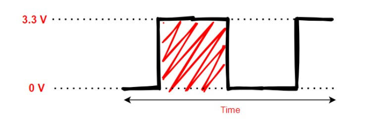
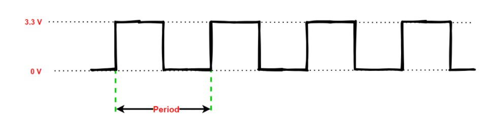
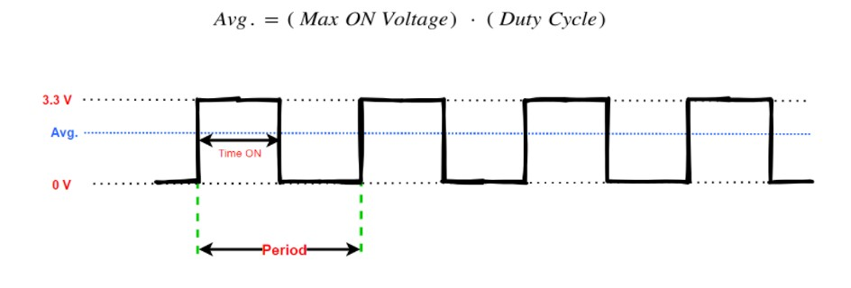
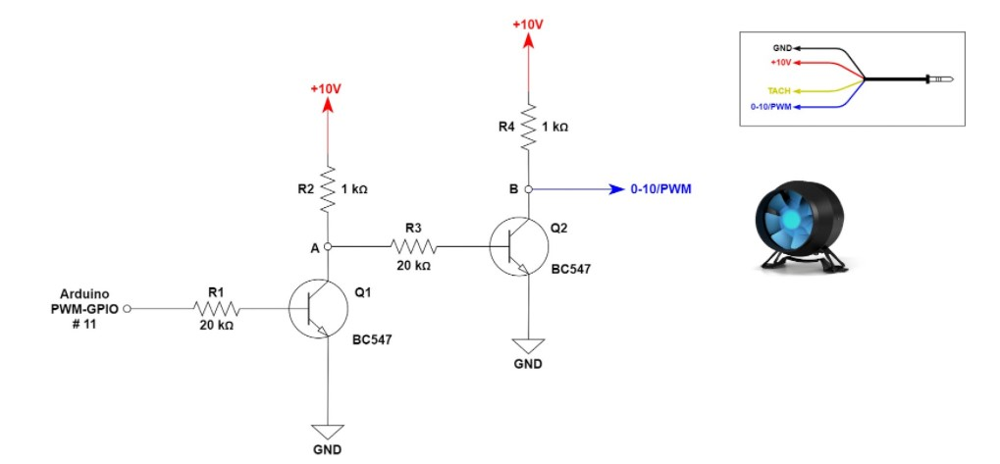
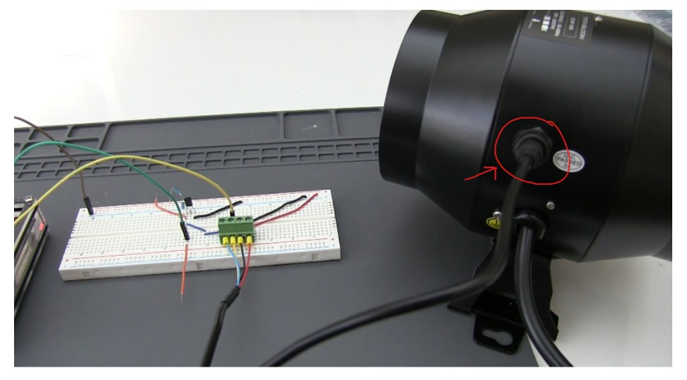
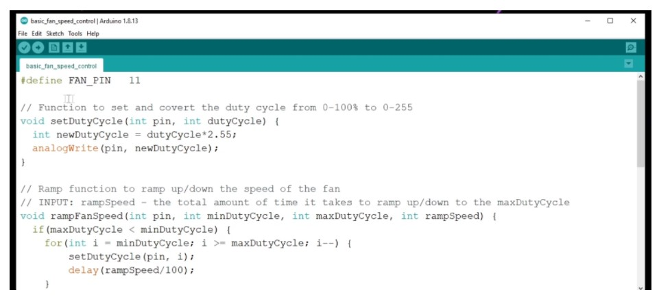
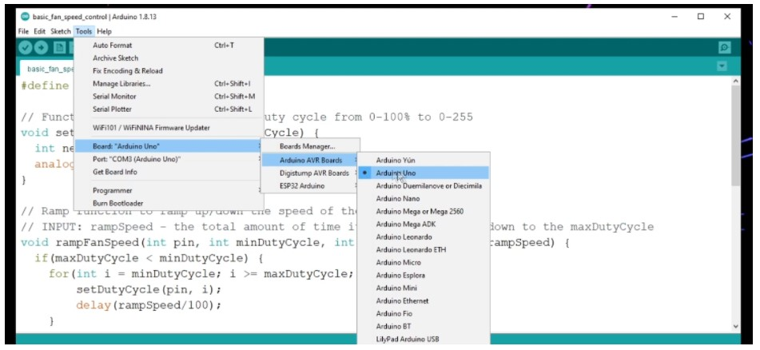
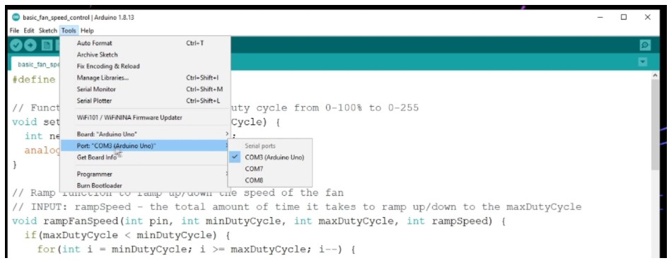
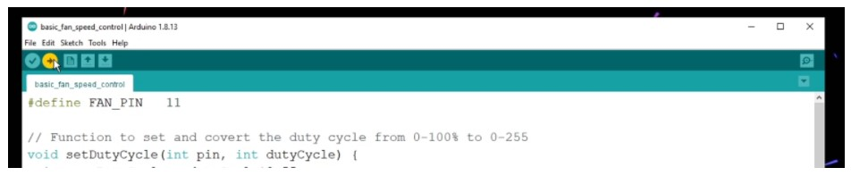

# Arduino TerraBloom Basic Fan Speed Control

In this article you will learn how to control your TerraBloom Fan’s speed using PWM with an Arduino microcontroller. Be sure to have your Arduino IDE setup and come prepared with just some of the basics of how a microcontroller works such as the Arduino IDE. There are many wonderful articles and videos that teach this concept. This project will focus on controlling the TerraBloom Fan’s speed using PWM which is generated easily from the Arduino MCU. 

## Concepts

### Pulse Width Modulation (PWM) Basics

To control the TerraBloom EC fan, we will need to know the Pulse Width Modulation signal. This is a method of controlling the speed of the fan using a digital signal. You might be thinking, well how can you control an analog piece of equipment with only two states? That is essentially what a digital signal is. The answer is simply by modulating the pulse widths of the digital signal. This means that I can change the average voltage delivered to the fan over a period of time. The following is a single digital pulse.

As you can see, it is a square wave that starts from a value and hits a maximum for a period of time and then goes back to the starting value. These starting and ending values are actually the voltage of the microcontroller that we are using. You can imagine a microcontroller, a really fast and efficient switch that turns off and on a signal. It would look like the figure above if we turn on the signal for a period of time and then back off. Let us name those levels and give them values. We know that Arduino’s GPIO logical levels are 0 V to 3.3 V. Meaning that when the GPIO pin is OFF, it correlates with 0 V and if it is on then it correlates with 3.3 V. V here is Voltage. 

Now, if we were to repeat this off and on process over and over again at a predefined time, we will essentially produce a wave such as the one shown below.

The period is the time it takes for the signal to repeat itself. This is an important parameter of the PWM signal. Now let us use another important parameter, which is the time the ON pulse stays on. Adding this parameter to our waveform as follows.

So now we have Period, which is the time it takes for the signal to repeat itself. We just added the time of the ON signal labeled as “Time ON”. Anytime you hear PWM, you also hear along with it the Duty Cycle. The duty cycle is the time ON over the period. In other words, it is what describes the signal’s power and it is in percentage. This ratio will determine the speed of the TerraBloom Fan. If you provide 100% PWM, it means that the ON signal is equal to the Period and therefore it will be always ON. Therefore, the duty cycle is given by the following equation:

From the duty cycle we can then calculate the average voltage of the PWM signal. This can be obtained by the following relationship.

The TerraBloom fan however requires that the PWM be from 0 V to 10 V. This cannot be achieved with just 0 V to 3.3 V from the Arduino. We have to build a mechanism to shift up the voltage level from a max of 3.3 V to a max of 10 V. To do this, we will build a Level Shifter circuit.

## System Overview

We will write a C++ program that runs on the Arduino MCU that produces a PWM signal from one of the PWM enabled GPIO pins. Then we feed that signal into the Level Shifter Circuit, in which the signal would be amplified to 0-10V PWM. The amplified PWM signal is then fed into the TerraBloom Fan’s PWM input pin (BLUE Wire).

## Materials Needed

| Item          | QTY           |
| ------------- |:-------------:|
| Breadboard    | 1 |
| Wire to Board Terminal Block - 4 Wires (OPTIONAL) | 1 |
| Various Wires | N/A |
| 20 kΩ Resistor | 2 |
| 1 kΩ Resistor | 2 |
| NPN Transistor - BC547 | 2 |
| Arduino | 1 |
| TerraBloom Fan | 1 |

-------------------------------------------------------------------

## Project Steps

### Step 1: Build the Level Shifter Circuit

Connect your breadboard as shown below, use the schematic shown above as reference. Keep in mind that the transistor BC547 does not have to be the exact same model, it can be any NPN that can handle 100 mA. This is common for a lot of widely available NPN bi-polar junction transistors.

Be sure to use GPIO # 11 on the Arduino to enable the PWM signal at approximately 31 kHz.

### Step 2: Connect the TerraBloom TRRS 3.5 mm jack to the TerraBloom Fan

Connection example shown below:

### Step 3:  Launch your Arduino IDE and copy the code in the TerraBloom Repo here. 

Then paste the code into a new Arduino IDE code.

Save this code and plug in your Arduino into the PC using the USB.

### Step 4: Select the correct Arduino board

Go to **Tools > Board > Arduino AVR Boards > Arduino Uno**. If you are using Arduino Uno, if you are using a different board type, be sure to select the correct one. 

### Step 5: Select the correct Port COM number

Under **Tools > Port > (Select your COM Number)**

Select the correct COM number for your Arduino Board, for some boards the Arduino IDE will automatically detect that this is an Arduino and will show its name next to the COM number as shown below.

### Step 6: Upload the code

Upload the code to your Arduino by pressing on the Upload icon at the to left corner of the Arduino IDE as shown. 

After upload is completed, the fan should start to ramp up its speed and then ramp its speed back down.
