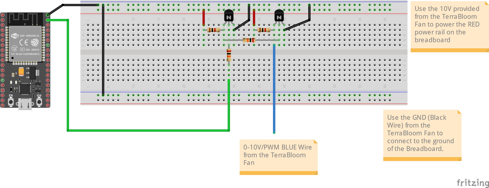
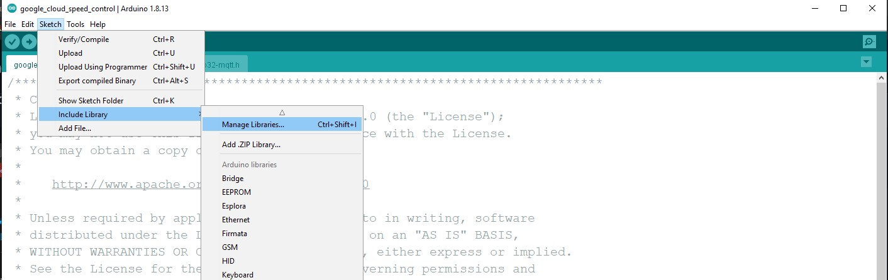
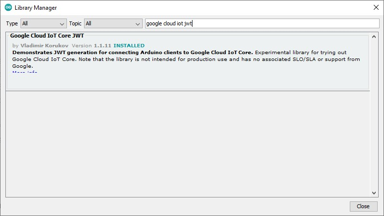
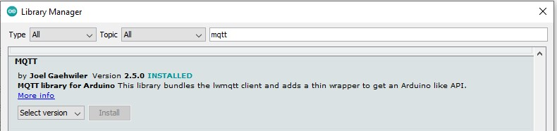
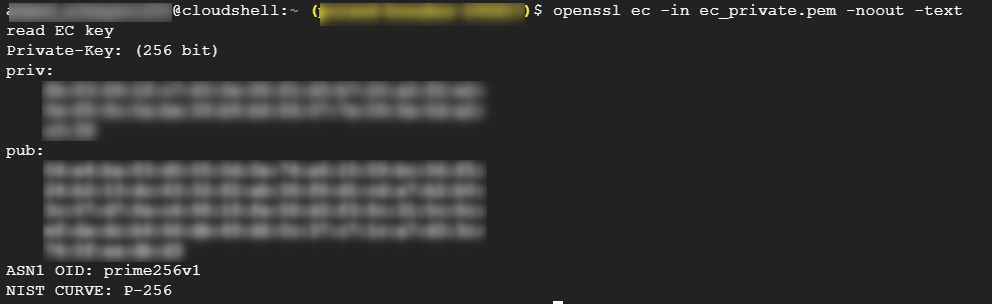
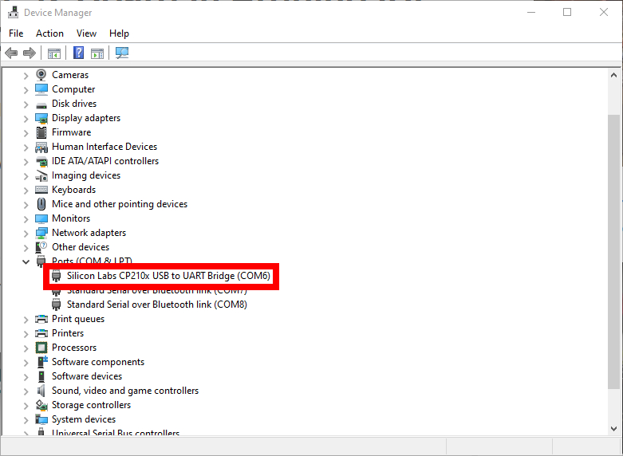

# Control your TerraBloom Fan from Google Cloud
This project will show you how to control your TerraBloom Fan from the cloud. This tutorial is aimed at anyone who is a beginner and has some familiarity with Arduino IDE. We will be using an ESP32 as our Arduino in this case since the ESP32s come with WiFi and BLE chips already integrated within the microcontroller unit. Let us go ahead and get started.

What you will need:
- [ESP32 DevKitC](https://www.mouser.com/ProductDetail/Espressif-Systems/ESP32-DevKitC-32D?qs=%252BEew9%252B0nqrDsObWEpDx6YQ%3D%3D)
- Arduino installed and setup
- [A TerraBloom Fan](https://terra-bloom.com/)
- Level Shifter Circuit (refer to [basic_fan_speed_control](../basic_fan_speed_control/README.md) to build the level shifter)
- [A Google Cloud Account (you can set one up for FREE)](https://cloud.google.com/)

## Pre-Project Setup
1. Setup a [Google Cloud Account](https://cloud.google.com/)
2. Activate a Cloud Shell - it is located on the top right corner of the header in the Google Cloud Platform Console as follows:

3. In the new terminal execute the following commands (source: [Google Cloud IoT Arduino Repo](https://github.com/GoogleCloudPlatform/google-cloud-iot-arduino))

Setup a Pub/Sub topics:
```
gcloud pubsub topics create terrabloom-pub --project=YOUR_PROJECT_ID
gcloud pubsub subscriptions create terrabloom-sub --topic=terrabloom-pub
```

Create a Cloud IoT Core Registry:
```
gcloud iot registries create terrabloom-registry --region=us-central1 --event-notification-config=topic=terrabloom-pub
```

Generate an Elliptic Curve (EC) private / public key pair:
```
openssl ecparam -genkey -name prime256v1 -noout -out ec_private.pem
openssl ec -in ec_private.pem -pubout -out ec_public.pem
```

Create and register a new device (A single TerraBloom Fan):
```
gcloud iot devices create terrabloom-test-dev  --region=us-central1 \
    --registry=terrabloom-registry \
    --public-key path=ec_public.pem,type=es256
```

Now we are ready to connect our fan to the Google Cloud. Follow the following steps to do this.

## Step 1
Connect your ESP32 DevKitC to the level shifter. Use GPIO23 to the Base of Q1. Connect your ESP32 DevKitC to your PC with the USB cable. Build the circuit shown in the following diagram on a breadboard.


## Step 2
Start your Arduino IDE and install the following packages from the Arduino Library Manager:
- [Google Cloud IoT JWT](https://github.com/GoogleCloudPlatform/google-cloud-iot-arduino)
- [MQTT](https://github.com/256dpi/arduino-mqtt)

To include the libraries: **Sketch** > **Include Library** > **Manage Libraries** and then search for each of the above mentioned libraries and install them.




## Step 3
Download the Repo Zip file and extract it. Then navigate to the **google_cloud_speed_control** subfolder under **arduino_platform**.

## Step 4
Open the **google_cloud_speed_control.ino** file in your Arduino IDE.

## Step 5
Go to the **ciotc_config.h** tab on the Arduino IDE, and change the following to your own settings:

__WiFI:__
- wifi ssid
- wifi password

__Google Cloud IoT Core:__
- project_id
- location
- registry_id
- device_id

__Keys:__
- private_key_str

To get your private key - head back to the Cloud shell we were working on earlier and execute the following command to obtain the private key:
```
openssl ec -in <ec_private.pem> -noout -text
```
Which should output something similar to the following screenshot:


You want to copy the entire key under the "priv:" heading. Then paste it one line at a time in your Arduino ciotc_config.h file.

- root_cert

Execute the following command in your Cloud Shell and then copy and paste the root certificate key between ----BEGIN CERTIFICATE---- and until ----END CERTIFICATE----
```
 openssl s_client -showcerts -connect mqtt.googleapis.com:8883
```

## Step 6
Upload the code to the ESP32 using the Arduino IDE.

**NOTE:** If this is the first that you use an ESP32 with Arduino, please follow the [RANDOM NERD TUTORIALS on how to setup your ESP32 on Arduino IDE](https://randomnerdtutorials.com/installing-the-esp32-board-in-arduino-ide-windows-instructions/).

The ESP32 Board URL - https://dl.espressif.com/dl/package_esp32_index.json

**HINT** To find your COM# on windows, go to the search bar and lookup "Device Manager" and then expand the ports. Under Ports you should see a port named "Silicon Labs CP210x USB to UART Bridge (COM#)". Keep note of that COM number as that will be your port number.



- Select the correct board by going to Tools > Board > ESP32 Arduino > ESP32 Dev Module
- Select the Port number (Tools > Port)

Leave everything else as default.

Hit the **Upload** button and the program should not start uploading to the ESP32 module.

## Step 7
Launch the Serial Monitor (Tools > Serial Monitor) and be sure to select the 115200 baud rate. Wait for the following message:
```
Library connected!
incoming: /devices/terrabloom-test-dev/config - 
```
This will indicate that the ESP32 module has connected successfully to the Google IoT Cloud. To confirm you can go to the Google Cloud IoT Core and to the Device and you will see under the Latest activity, Telemetry event received showing the most recent time the device connected and sent a telemetry message.

(OPTIONAL) You may now disconnect the ESP32 from your PC and can use and generic USB wall plug and the USB cable to power your ESP32 anywhere.

## Step 8
Execute a command in your Google Cloud Console by going to **IoT Core > Devices > terrabloom-test-dev** and then select **SEND COMMAND** in the top banner. 

Select Text as the format and for the command data enter a value between 0 to 100 and press **SEND COMMAND** button.

Your _ESP32_ should now turn on the fan to your specified Duty Cycle from anywhere in the world!

