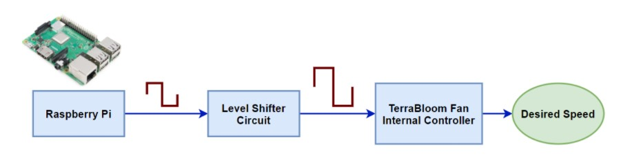
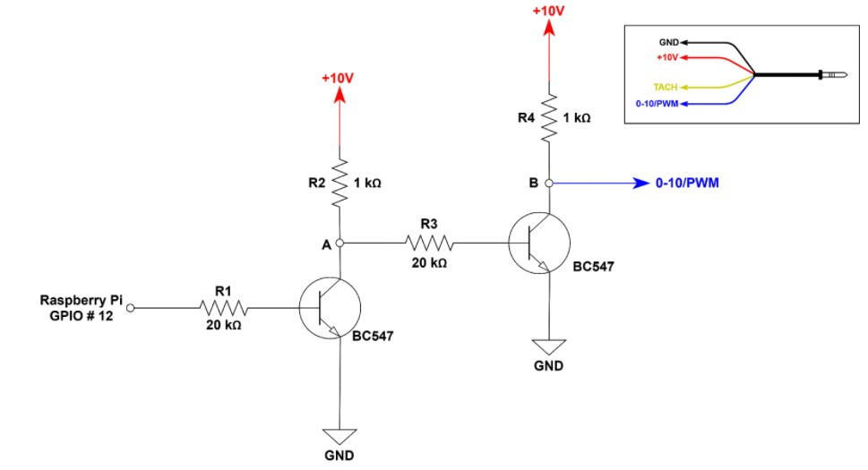
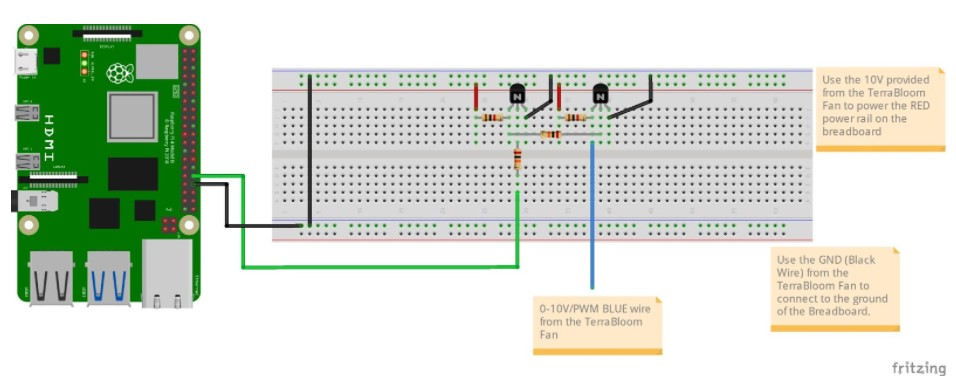
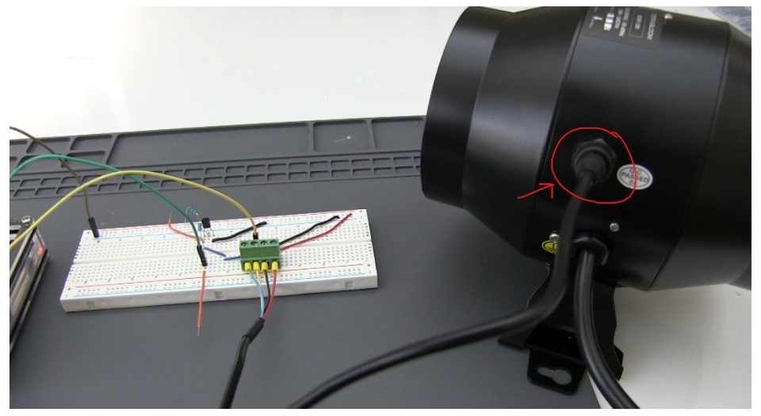
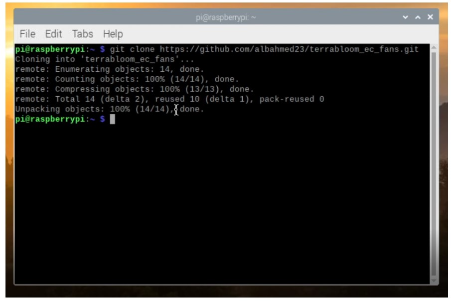
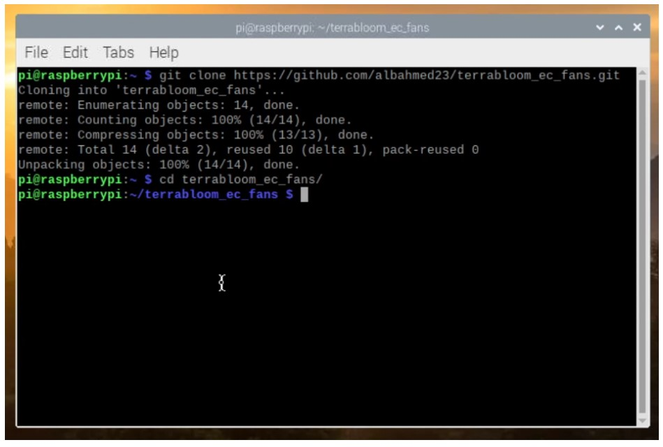
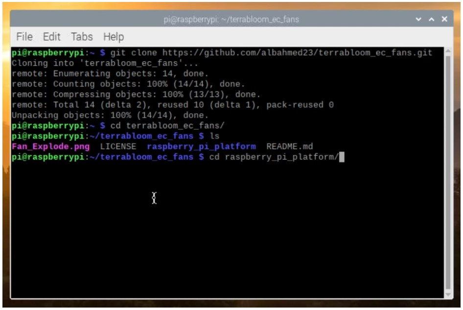
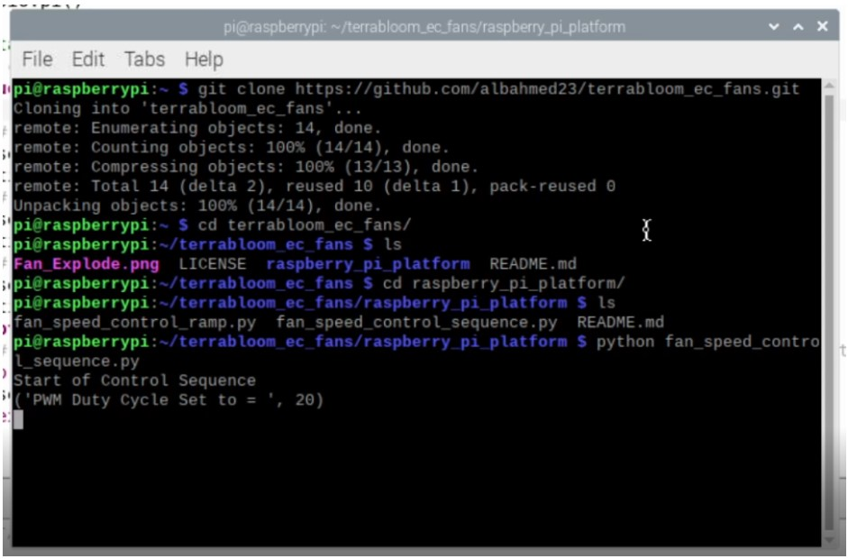

# Raspberry Pi Platform
Use this sample to quickly setup your Raspberry Pi and start controlling TerraBloom's EC fan's speed. Python code samples are given here and they are based on [pigpio](http://abyz.me.uk/rpi/pigpio/) library.

## fan_speed_control_ramp.py
This script will ramp up the speed of the fan based on the time delay between each increase of the PWM duty cycle.

## fan_speed_control_sequence.py
Control the fan speed sequentially, in other words, change the speed in steps rather than ramping.

# Raspberry Pi Basic TerraBloom Fan Controller
In this project you will learn how to control your TerraBloom Fan’s speed using PWM with a Raspberry Pi small computer. This will be a tutorial aimed at a total beginner, you do not have to know any knowledge other than basic electronics. Let’s go ahead and start.

## System Overview




We will write a Python program that produces a PWM signal from one of the hardware-PWM enabled GPIO pins. Then we feed that signal into the Level Shifter Circuit, in which the signal would be amplified to 0-10V PWM. The amplified PWM signal is then fed into the TerraBloom Fan’s PWM input pin (BLUE Wire).


## Materials Needed

| Item          | QTY           |
| ------------- |:-------------:|
| Breadboard    | 1 |
| Wire to Board Terminal Block - 4 Wires (OPTIONAL) | 1 |
| Various Wires | N/A |
| 20 kΩ Resistor | 2 |
| 1 kΩ Resistor | 2 |
| NPN Transistor - BC547 | 2 |
| Raspberry Pi | 1 |
| TerraBloom Fan | 1 |

-----------------------------------------------------------

## Project Steps

### Step 1: Build the Level Shifter Circuit



Connect your breadboard as shown below, use the schematic shown above as reference. Keep in mind that the transistor BC547 does not have to be the exact same model, it can be any NPN that can handle 100 mA. This is common for a lot of widely available NPN bi-polar junction transistors.



Be sure to use GPIO # 12 on the Raspberry Pi to enable the hardware-PWM.


### Step 2: Connect the TerraBloom TRRS 3.5 mm jack to the TerraBloom fan 

connect as shown below:




### Step 3: Clone the TerraBloom Sample Code Repo

**3.1** - Go to your terminal on the Raspberry Pi and enter the following command while in a directory where you want the TerraBloom Sample Code to be saved in.

```
git clone https://github.com/albahmed23/terrabloom_ec_fans.git
```



**3.2** - Change directory into the Repo
Go ahead and change the directory of your terminal into the terrabloom_ec_fans/ root folder. Run the following command:

```
cd terrabloom_ec_fans/
```




**3.3** - Change directory into the raspberry_pi_platform/
Run the following command:

```
cd raspberry_pi_platform/
```




You will notice that there are two Python scripts:
- **fan_speed_control_ramp.py** - Smooth changes of the speed as ramping
- **fan_speed_control_sequency.py** - sharp changes in the speed as steps

You may make any customizations and changes to the scripts to fit your needs and for you to practice on. This script, though, should work out of the box and can be ran using your Python interpreter. To do this follow along.


**3.4** - Run the fan_speed_control_sequence.py script as follows:
Enter the following command in the terminal where the two files are.

```
python fan_speed_control_sequence.py
```



The program should run and your fan should start to sequence through different speed levels.

You can repeat the same process again if you would like to try the ramping the speed of the TerraBloom fan’s speed in a smoother way.

